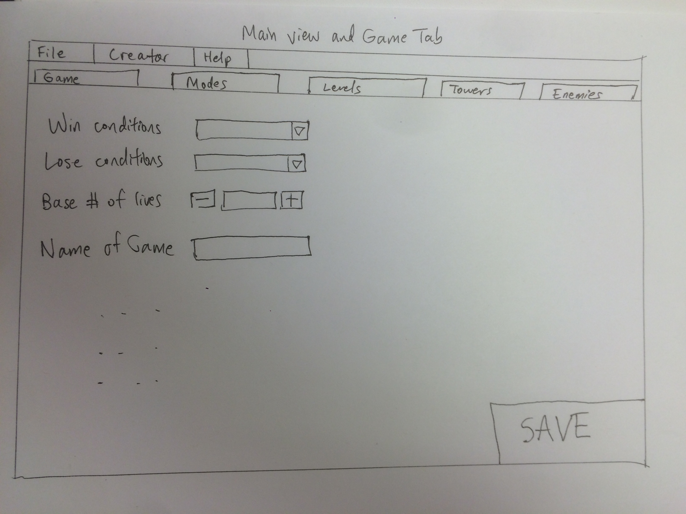
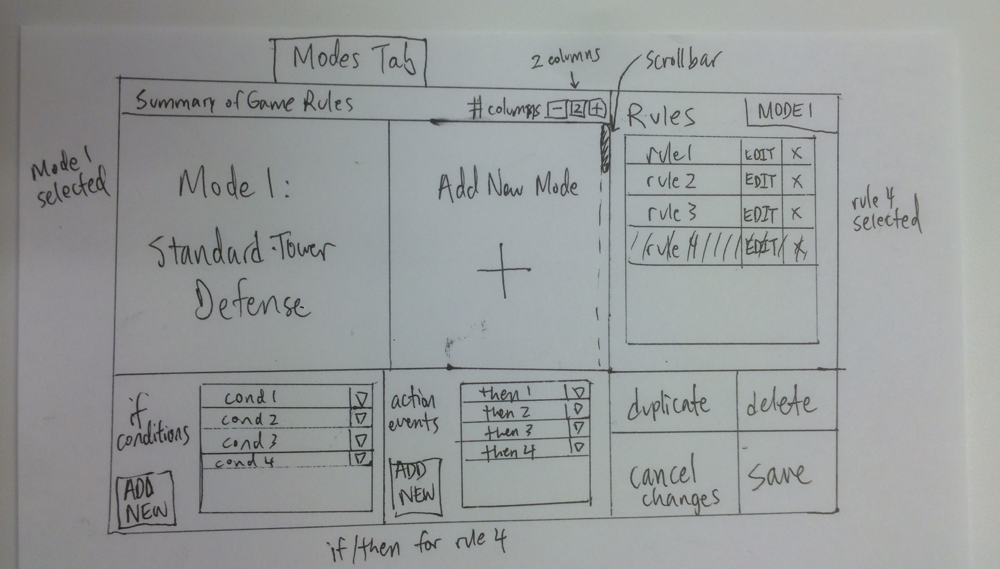
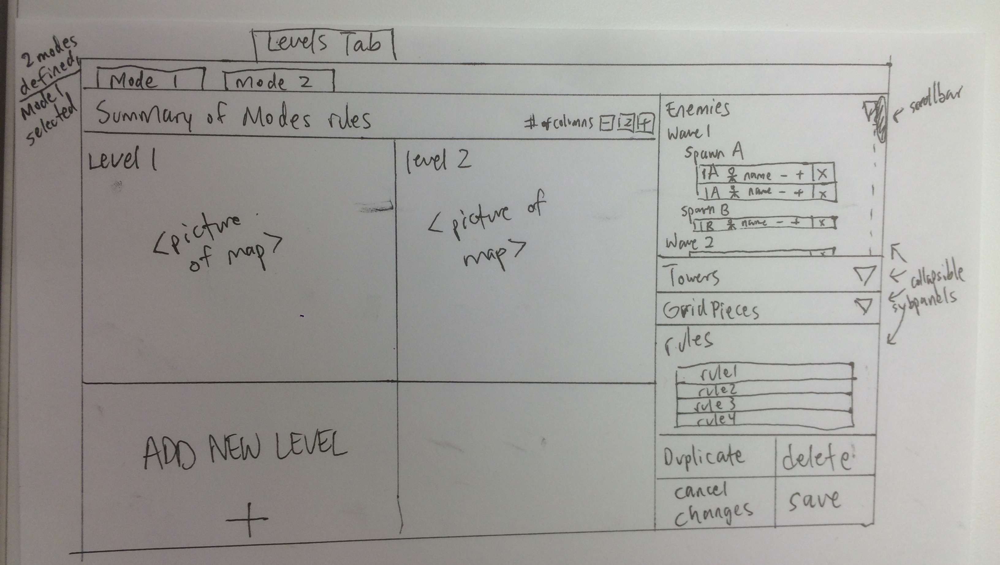
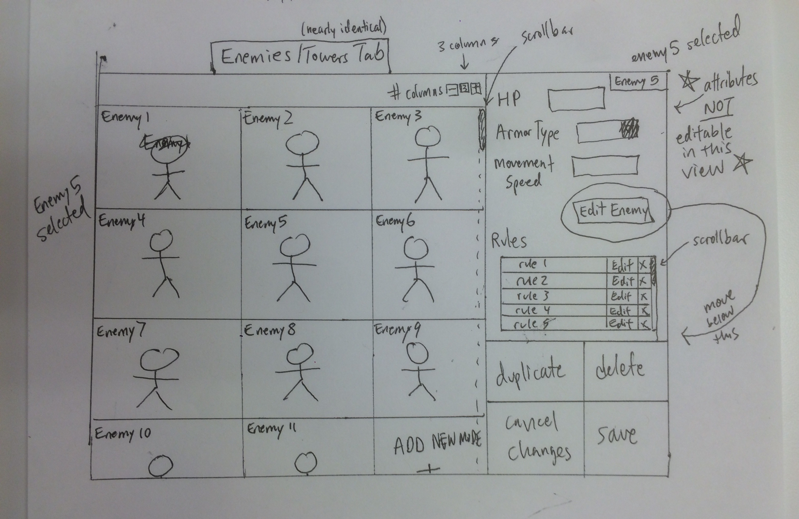
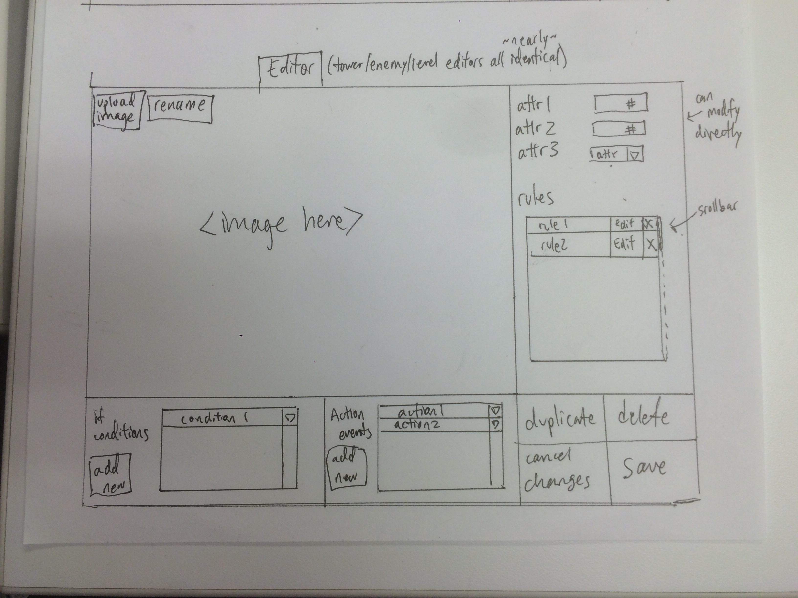
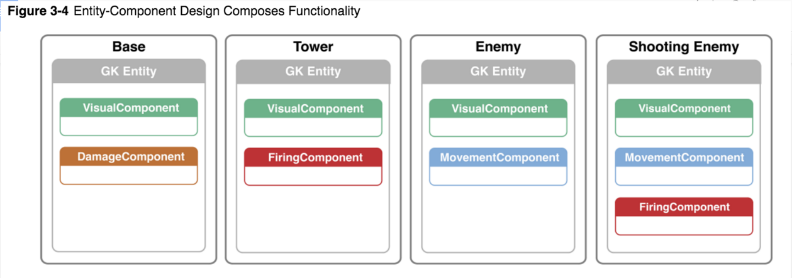
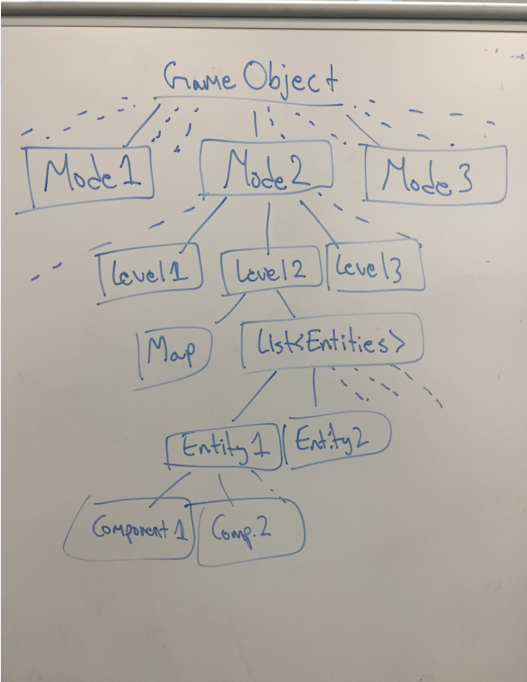

#Introduction
* This section describes the problem your team is trying to solve by writing this program, the primary design goals of the project (i.e., where is it most flexible), and the primary architecture of the design (i.e., what is closed and what is open). Describe your chosen game genre and what qualities make it unique that your design will need to support. Discuss the design at a high-level (i.e., without referencing specific classes, data structures, or code).
	* Our chosen game genre is tower defense. Tower defense involves a basic set up of enemies and “towers.” The enemies and towers interact - hence the “defense” and the user defines the manner in which one can win or lose. The main unique features of tower defense are the two opposing types of units - towers (to help you) and enemies (to attack you). If the user does nothing against the enemies, the user will lose. Defeating enemies can give the user resources which help the user manage more difficult waves of enemies. The design goal is to be able to create not only differing levels of difficulty within the standard tower defense scheme, but also to be able to support a variety of game types. Our game is most flexible when it comes to mode and level configuration, though the list of configurable rules at each tier of the hierarchy is predefined. The user has the flexibility to select whichever modular pieces to piece together to form the game.
The primary architecture of the design is very open between the two backend components, as the game authoring environment and the game engine share many classes. On the frontend, some classes will be shared between the player and the authoring environment, but not nearly as many. We will be using Java’s observable observer interface to pass data between the frontend and backend, so the objects passed themselves will be completely open too.

#Overview
* This section serves as a map of your design for other programmers to gain a general understanding of how and why the program was divided up, and how the individual parts work together to provide the desired functionality. Describe specific modules you intend to create, their purpose with regards to the program's functionality, and how they collaborate with each other, focusing specifically on each one's API. Include a picture of how the modules are related (these pictures can be hand drawn and scanned in, created with a standard drawing program, or screen shots from a UML design program). Discuss specific classes, methods, and data structures, but not individual lines of code.
	* Authoring Environment
		* The authoring environment gives the player access to all levels of the game (game, modes, levels, towers, enemies) and allows the user to modify parameters. The authoring environment is set up using a model-view-controller. The model, or backend, contains all the information within a model singleton. This singleton has access to all the relevant information that can be modified, and changes to this information is received by the singleton from the controller. The controller acts as a highway and pipeline for each of the view elements to pass information down to the backend. The view and model do not have access to each other with this design. Both the frontend and backend will have a hierarchy of higher-level components containing lower-level components, with each of the lower-level components having only access to the components that are at even lower levels, but having no access to levels above them. 
		* The primary modules will contain game-rule modification, mode-rule modification and creation, level-rule modification and creation, and tower/enemy creation. Each of these has a view (in a tab) that the user can navigate between, but only some aspects can be modified by the user depending on which view they are on.
	* Game Player
		* Our game player will be responsible for loading a game generated by the game authoring environment from an XML file, allowing one or multiple users to play the game, pause the game, and save the game. The game will be some game within the tower defense genre, whether that is something like Plants versus Zombies, or something like Bloons Tower Defense, it will have some themes common in all tower defense games. 
		* The game player will allow users to drag and drop towers, start, stop, and pause the game, see current information about various monsters and towers, and upgrade towers (if possible). The game cycle will be organized into four phases- the initialization phase, the play phase, the pause phase, and the prep phase. 
	* Game Engine
		* Our game engine is responsible for handling and executing actual game play. This is where we will have our game loop which will progress the game step by step. This is also where all the game statistics will be stored. 
		* Our engine will have an Entity Component System (ECS) design architecture. In this design, all the game data is essentially stored in a database structure, where Entities contain components, and the components store instance variables. The actual game logic resides within different Systems, which modify and massage the game data. 
		* With this design we will be able to handle a variety of different tower defense games with different capabilities and rules. 

#User Interface
	* This section describes how the user will interact with your program (keep it simple to start). Describe the overall appearance of program's user interface components and how users interact with these components (especially those specific to your program, i.e., means of input other than menus or toolbars). Include one or more pictures of the user interface (these pictures can be hand drawn and scanned in, created with a standard drawing program, or screen shots from a dummy program that serves as a exemplar). Describe how a game is represented to the designer and what support is provided to make it easy to create a game. Finally, describe any erroneous situations that are reported to the user (i.e., bad input data, empty data, etc.).
		* Game Authoring Environment
			* The authoring environment is primarily structured as a group of tabs that the user can switch between. There is a menu bar that the user can access at any time if they wish to save or load an authoring environment, to open any editors, or if they wish to open a help page. The tabs include Game, Mode, Levels, Towers, and Enemies. Another tab for grid pieces may be added depending on group preference for whether we want to make that an editable aspect of the game.
			* The game tab consists of a simple collection of dropdown menus and text input areas for the user to select rules that apply throughout the entire game. This would include things like the base number of lives (if applicable), winning and losing conditions, number of players (if applicable), how resources are obtained, and how score is calculated. At a conspicuous part of the tab will be a save button that locks in all the information set by the user and updates the backend.
				* 
			* The modes tab is set up in four quadrants. 
				* The top left quadrant consists of a brief summary of game rules at the top, a grid, and options to change the number of columns in the grid. Each of the grid squares will contain either a photo or a name of a mode, and the final element in the grid that isn’t empty will be an “add mode” button. This grid will automatically expand itself and the user will be able to scroll down if multiple modes are created. 
				* The top right quadrant consists of an expandable list (that the user can scroll through) that lists all the created rules for the mode the user selects. If no mode is selected, then no rules are displayed. The rules each have an option to edit or delete.
				* The bottom left quadrant is a rule editor. This is split into a left half and a right half. The left half contains the “if” conditions, along with a button for adding additional conditions. Another expandable list (that the user can scroll through) of statements displays all the if conditions for that specific rule. The right half is mirrored, except with actions instead of if conditions. At the very right of this quadrant is the option to save or cancel the rule.
				* The bottom right quadrant is simply a collection of large buttons (save, duplicate, or cancel button) which locks in the information for the rules created for each mode.
				* 
			* The Levels tab is constructed in a very similar manner to the Modes tab. 
				* Inside this tab is another set of tabs, one corresponding to each of the modes created by the user. 
					* Instead of the left having a top and bottom half, however, the entire left half is just a quick summary of the mode rules at the top, an option to change the number of columns, and a grid displaying all the levels with the number of the level in the middle of each square. 
					* The top right half contains a collapsible panel for enemies, towers, grid pieces, and rules. Each of the collapsible sub-panels displays the level-specific objects that are created by the user. Each of these sub-panels has an edit option upon right-clicking each element in the list of enemies/towers/grid pieces and a button at the bottom of the sub-panel that allows the user to create additional game pieces. Pressing the create additional game pieces button will pop up the corresponding editor window, which is described later. 
					* The bottom right contains buttons that affect the level selected (the buttons do nothing if no level is selected). These options include delete level, duplicate level, and cancel or save level.
				* 
			* The Enemies and Towers tab are also constructed similarly, though the two differ slightly from the Levels and Modes tabs (while being nearly identical to each other).
				* The left half looks exactly like the Levels tab, except with photos and names of enemies/towers instead of the level number.
				* The top right contains game object-specific attribute information, for example HP/armor type/speed for enemies or attack range/attack speed/damage for towers. These are displayed in rows, with no user option for adding additional attributes. At the bottom part of the top right quadrant is an expandable list (that the user can scroll through) for rules that apply to only the game object (for example, enemy type could speed up if hit points falls below a certain amount). At the bottom of the top right quadrant is a large button that allows the user to edit the enemy/tower, which pops up the corresponding editor.
				* The bottom right looks identical to the bottom right of the levels tab, with a save/cancel/duplicate/delete option for the game object selected. 
				* 
			* There are also editor panels which pop out (and are separate from the main scene that the tabs are on). The user can navigate to the TowerEditor, LevelEditor, or EnemyEditor directly from the menubar, which would pop up a blank editor. Selecting the edit option directly from the main tab window would pop up an editor that is already populated with the created attributes. The editors are also divided into quadrants and look very similar to the existing views. 
				* The left side is split into two halves again, with the top left being primarily composed of the tower/enemy image, along with an upload image button. The bottom left contains a rule editor panel that looks identical to the rule editor panel in the Modes tab. 
				* The top right contains enemy/tower specific attribute information that the user can change directly (as opposed to the Enemy/Tower tab views, which do not allow direct editing). The bottom right contains the same options that the enemies/towers/levels tabs have: save, delete, duplicate, or cancel.
				* 
		* Game Player
			* The Game Player is intended to graphically display the state of the game that is both stored and executed by the game engine. 
			* In order to provide for later extensibility to the player, displays are to be segmented into objects called panes each of which can hold multiple graphical nodes. Each display can be defined to have a given size and location with respect to the window in which the program is executing  
			* Currently, the Game Pane, Shop Pane, and Status Pane are three special types of panes that interact with the user in the predetermined ways described below
				* Game Pane - Displays the graphics of the game and constitutes the general in which the game is viewed. 
					* Objects selected from the shop should be able to be placed in the game pane 
					* Objects extant in the game pane should be able to display additional information if desired - determined by the running game’s parameters
					* Renders data objects from the back end as sprites/images for user interaction
				* Shop Pane - displays objects that can be added into the Game Pane
					* The shop will display the various types of towers that can be purchased and added into the Game Pane
					* Each tower will display its attributes including:
						* Icons
						* Names
						* Firing Properties
					* Depending on parameters, various properties/additional information may only be displayed when moused over or clicked
					* To be implemented via a scrollable list view
				* Status Pane - Displays elements monitoring data related to the global state of the game including: 
					* Round Number
					* Lives Remaining
					* Game Time/Progress
					* Game Score
					* Total Resources Available
					* Execution Speed of Game
			* Additionally, the Game Player will contain a menu bar at the top of the primary window that will allow users to initialize new games or save the current state of a running game.
				* New Game
				* Load Game
				* Save Game
				* 

#Design Details 
* This section describes each module introduced in the Overview in detail (as well as any other sub-modules that may be needed but are not significant to include in a high-level description of the program). Describe how each module handles specific features given in the assignment specification, what resources it might use, how it collaborates with other modules, and how each could be extended to include additional requirements (from the assignment specification or discussed by your team). Note, each sub-team should have its own API for others in the overall team or for new team members to write extensions. Finally, justify the decision to create each module with respect to the design's key goals, principles, and abstractions.
	* Backend
		* For our Game Engine we will be using the Entity Component System (ECS) design. In this system, we have Entities that contain different components depending on their functionality. We then have different Systems that iterate through all the entities and modify only the entities that have the desired components. It’s important to note that the Entity is only a container for Components, and Components just store Data. All the actual game logic is handled in the Systems. 
		* Entity
			* The abstraction is that an entity is just an ID; a container of components. Each entity will have just an id and components property.
		* Component
			* Components will be structured just like Entities. They will contain any instance variables relevant to that specific component. For example, a Position component would store an x coordinate and a y coordinate. 
		* System
			* Systems run your game's logic. They take in entities and run operations on entities that have specific components the system requires. For example, if we have a Movement System, it would only look for Entities that have both a Position Component and a Velocity Component, and the Movement system would update those components accordingly. 	
		* Here is a diagram of how the Entities and Components will be structured:
			* 
		* So in our design, an actual Game object will be structured as follows:
			* 
		* Sprite creation
			* This will occur through use of abstract factory design. Sprite is composed of different components. Calling a factory class for a sprite is going to call all of the necessary factory classes for each component.
			* Our Engine class will essentially have one method called step(), which will iterate through all the different Systems and apply them to our Game object. This is how the Game will progress. 
			* We will also have Rule Objects. A Rule object will have a List of predicates that are evaluate, and if all are satisfied, it will have an action that will be enacted. These Rule objects will be controlled in our Systems since the Systems are responsible for the actual game logic. 

	* Authoring Environment
		* In the front end, the editors and display tabs will be organized in an inheritance hierarchy.
		* As the authoring environment sole task is to create and edit game entities and components, its main functionality will be based on creating and updating components, and setting and getting variables. Hence, we plan on using a model-view-controller design for interactions between the front end and the back end of the authoring environment. The view and the model will interact through a controller, with the view calling the controller to update the various components and entities in the model when the user enters new data, and the controller will then tell the model to notify each of its components’ observers.
		* The authoring environment is going to be based on one key principle - the creation of a game object is dependent simply on lists. At each level of abstraction (Mode, Level, Entity), lists of deeper levels are contained and authoring boils down to adding / removing objects from these lists. For example, a Mode will contain List < Levels >, a Level will contain List < Entities >, and an Entity will contain List < Components >. When adding a new level to a certain mode, the addLevel() method of that mode will be called and the controller will pass back a Level object. This Level object will then be included within the list for the specific level. In the case of adding a new ability to a tower for example, the specific component being added will be appended to the List < Components > for that specific tower. In this way, the authoring environment can be abstracted down to one simple function. In addition, finer user control can be enabled by allowing them to change specific instance variables within components themselves (which would allow stronger enemies or weaker towers). 
		* The final responsibility of the authoring environment is to pass in the created game object to the engine, which will then proceed to handle gameplay. This will be handled by the GameInitiationController, which additionally allows the conversion of this game object to an XML file. 
	* Player Frontend
		* The frontend of the player will be comprised of three main components- the boardview, the statusview, and the towerview. The boardview will show the current game and any board-based functionality. The towerview will show all the potential towers and any tower-based functionality (including upgrading towers). The statusview will show the current status/states of the game, as well as any game-level functionality, such as pausing, playing, saving, etc.
		* We will construct this functionality through using three classes, BoardView, TowerView, and StatusView, which will be responsible for creating and modifying the portions of the view they are responsible for based on model data. These classes will undoubtedly contain internal components as well, both in terms of Node objects and also other classes to encapsulate specific functionality.

#Example games
	* Describe three example games from your genre in detail that differ significantly. Clearly identify how the functional differences in these games is supported by your design and enabled by your authoring environment. Use these examples to help make concrete the abstractions in your design.
		* Standard tower defense (i.e. bloons tower defense)
			* This game involves waves of enemies following a path set by the user or map from a spawn area towards an end zone. The player sets immovable towers which aim to defeat the enemies before they reach the end zone, which affects the user’s status towards winning or losing the game.
		* Hopeless (i.e. boxhead)
			* This game involves a mobile “character” (tower) that has its user-defined way to defeat enemies (projectile, melee, etc). The enemies follow a randomized path or a path directed towards the character from user defined spawn points (which could be random or restricted to a certain area), and the user can define how the enemies attack the character, which affects the user’s status towards winning or losing the game. The character is centered in the middle of the screen.
		* Top down shooter (i.e. archer)
			* This game involves a mobile “character” (tower) that fires projectiles at enemies, which spawn randomly or in waves from a spawn area opposite to the character. The enemies fire projectiles back at the character, and follow a programmed or random path and maintains a set distance from the character or closes in one the character. The character’s offensive capabilities can change depending on what the user defines.

#Design Considerations 
	* This section describes any issues which need to be addressed or resolved before attempting to devise a complete design solution. Include any design decisions that each sub-team discussed at length (include pros and cons from all sides of the discussion) as well as any ambiguities, assumptions, or dependencies regarding the program that impact the overall design.
		* Authoring Environment
			* One discussion was about the communication between the front-end authoring code and our game object creation. The initial idea was to use a publisher / subscriber model, where the frontend and backend share data using Observable objects. In this model, the view will take in some user input and will pass this change into the backend which will then implement this change. The frontend will then observe these changes through these Observables. All of these Observables can be bound in the Controller class. However, another idea that was brought up was using a refresh model, where the frontend sends the user inputted changes to the backend, the backend makes the changes, then the controller calls the singleton’s general refresh method, which finds all the data and iterates through them all, calling transforms the data to display in the front end. All of this would also be handled in the Controller class. In the end, we decided to do a combination of the two, where our data is held in Observables and whenever the frontend sends changes to the backend, the backend implements the changes and the Controller will call a singleton, which handles all of the Observables, and the singleton will iterate through all of the Observables and call their respective notify methods. 
	* Engine 
		* One of the hardest aspects of designing our game objects is how to structure Rules. Because we want the author to be as flexible and create as possible when creating Rules, we need to also be as flexible to accommodate different rules. An important realization is that there is an inherent Rule hierarchy, in that there may be broad Level rules (such as all towers start with a specific health), or specific entity rules, where specific entities interact in very specific ways in very specific situations. Because of this, we thought it would make sense to have different “Rules” exists in all the the different levels of our Game Object hierarchy. However, this would get extremely convoluted very fast, and it would make our code extremely bulky and inflexible. Instead, we decided to create separate Rule Objects that are controlled by the different Systems. This makes more sense because the Systems are responsible for the actual game logic and they also have access to the entire game Data. We still need to solidify this design decision and figure out how these Rule objects will exactly interact with our systems. 
		* Essentially, we have a clear idea of how an actual Game will be structured in terms of data. What we need to clarify is how game logic will be stored and executed. 
	* Player Frontend
		* So a major but somewhat isolated design consideration for the player is whether or not we want to handle different game player layouts, similar to multiple workspaces in Slogo. And if we want to handle multiple workspaces, how flexible would that functionality be? We discussed having both rearrangeable and resizeable panes, but ultimately as of this meeting settled on rearrangeable. The pros of having both would be more customizability, but the major con was the sheer developmental cost to accomplish the relatively less useful feature of resizability.
